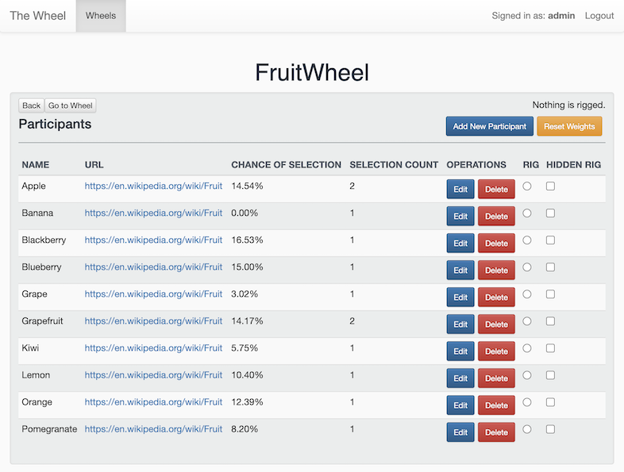

# Introduction
The AWS Ops Wheel is a tool that simulates a random selection from a group of participants that weights away from participants recently chosen. For any group, the selection can also be rigged to suggest a particular participant that will be selected in a blatantly obvious (and sometimes hilarious) way.

Get your own in just a few clicks by starting here: [](https://us-west-2.console.aws.amazon.com/cloudformation/home?region=us-west-2#/stacks/create/review?filter=active&templateURL=https:%2F%2Fs3-us-west-2.amazonaws.com%2Faws-ops-wheel%2Fcloudformation-template.yml&stackName=AWSOpsWheel)

Or, simply set up a CloudFormation stack using the S3 template url: https://s3-us-west-2.amazonaws.com/aws-ops-wheel/cloudformation-template.yml

**We are aware of an [issue](/../../issues/3) where you can only run this stack in us-west-2 if you launch from this template, we are working on removing this limitation. This limitation does not apply if you build your own stack using the Development Guide below.**

The endpoint will then be in the CloudFormation Stack Output messages.

## ScreenShots
### Wheels Table

### Participants Table

### Wheel (pre-spin)

### Wheel (post-spin)


# User Guide
## Concepts
**Wheel**
  A group of participants that can be selected from. Users can get a suggestion of a participant from a wheel that is weighted away from recently-chosen participants.

**Participant**
  A member of a wheel identified by a name, which must be unique, and also a follow-through url when they are chosen. Participants all start with a weight of 1.0.

## Operations
### Wheel Operations
- Create a new wheel
- Edit an existing wheel
- Delete a wheel
- Spin the wheel and suggest a participant
  - ***Notes:*** This does not adjust weighting, so if you're unhappy with the result, you can spin again.
- Proceed: Accept the suggested participant
- Reset: Restart all participants to equal weights as 1.0

### Participant Operations
***Notes:*** Participants aren't shared between wheels

- Add a participant to a wheel
	- This requires a name and url that will be opened in a new browser tab when the participant is chosen. A participant begin with a weight of 1.0 which will always be the average weight for all participants.
- Edit a participant's name and/or url
- Delete a specific participant from the wheel
- Rig a specific participant to be selected next
    - This doesn't change any weighting, but actually bypasses the suggestion algorithm to always suggest the participant until told to proceed.
    - After proceeding, weights are adjusted as if the participant had been selected normally.
    - The rigging can be hidden (deceptive) or non-hidden (comical).

### Authentication and User management
AWS Ops Wheel is protected by Amazon Cognito authentication. It uses [Cognito User Pools](http://docs.aws.amazon.com/cognito/latest/developerguide/cognito-user-identity-pools.html) to manage users that have access to the deployed application.
By default, during the initial deployment phase, it creates an `admin` user with a random password that is sent to the email address provided to the `run` script.
During the first attempt to login to the AWS Ops Wheel, the `admin` user will be asked to change the random password to a new one.

If you need to add more users that have access to the wheel application, you can add them using AWS Cognito web console or using the AWS Cli.

### The Weighting algorithm

Assumption: `total_weight == number_of_participants == len(wheel)`. This is because we only redistribute weights among participants and all participants start with a weight of 1.0. The below is the algorithm in python pseudo-code:

```python
def suggest_participant(wheel):
    target_number =  len(wheel) * random()  # Get a random floating point number between 0 and the total_weight
    participant = None
    for participant in wheel:
        target_number -= participant.weight
        if target_number <= 0:
            break
    return participant

def select_participant(chosen, wheel):
    # When there is only one participant in the wheel, the selected participant's weight remains intact.
    # Otherwise, the remaining participant(s) get a slice of the selected participant's weight. That participant will not be chosen on next spin unless it's rigged.
	 if len(wheel) > 1:
	    weight_slice = chosen.weight / (len(wheel) - 1)
	    for participant in wheel:
	        if participant == chosen:
	            participant.weight = 0
	        else:
	            participant.weight += weight_slice
```

# Development Guide

***Notes:*** The development tools are currently only written to be Linux/OSX compatible

## Development Dependencies

- NodeJS 6.10+
- Python 3
	- boto3
	- pyaml
  - pytest
  - pytest-cov
  - moto
- AWSCLI 1.11+
- An AWS Account you have administrator privileges on


## A dedicated IAM User (Optional, but highly-recommended)
- You should create a dedicated IAM User for ``AWS Ops Wheel`` development

### Create a custom IAM Policy for the User

- Go to the [AWS Create Policy Wizard](https://console.aws.amazon.com/iam/home?region=us-west-2#/policies$new?step=edit)
- Go to the `JSON` tab and paste in the content of our [policy configuration](~/aws-ops-wheel/cloudformation/awsopswheel-create-policy.json)
- Click `Review Policy`
- Give it an identifying name (we'll need it for the next step) like *AWSOpsWheelDevelopment*

### Create an IAM user with the policy attached

- Got to the [AWS Create User Wizard](https://console.aws.amazon.com/iam/home?region=us-west-2#/users$new?step=details)
- Give it a descriptive name like *AWSOpsWheelDevelopmentUser* and check the `Programmatic access` checkbox.  **Note:** It doesn't need to be the same as the name of the policy, but it might help keep your things organized
- Click `Next: Permissions`
- Switch to the `Attach existing policies directly` tab and filter on the name you used during the *Create custom Policy* step
- Click the checkbox next to the policy and click `Next: Review`
- Click `Create user`
- On the next page, save the Access key ID and the Secret access key (visible by clicking `Show`) for use in the `AWS Cli Configuration` step.  **Note**: This will be the only opportunity to copy the Secret Access Key for this Access Key ID.  if you don't copy the secret access key now, you'll need to create a new access-key, secret-key pair for the user.


## AWS Cli Configuration
For the purpose of our work, we will use AWS Cli to simplify management of the resources.
Later we will add support for the `Launch Stack` button which will be displayed on the GitHub Repo page.

In `$HOME/.aws/config` add in your credentials configuration and default region, replacing with your IAM user's credentials (or your own access key and secret key if you didn't follow our highly-recommended best-practice).  **Note**: The region can be whatever region you choose, but you should definitely set a default region.  We chose us-west-2 since we're in Seattle and it's close by.

```
[default]
aws_access_key_id = ACCESS_KEY
aws_secret_access_key = SECRET_KEY
region = us-west-2
```


## Test the code

Currently we have unit tests for the API and the UI. 

To run the API unit tests: 
* If you haven't already, go to the ``<PATH_TO_YOUR_WORKSPACE>`` directory and install the required dependencies using:
  ```
  pip install -r requirements.txt
  ```
* Go to the ``<PATH_TO_YOUR_WORKSPACE>/api`` directory and run:
  ```
  pytest --verbose --cov-report term-missing --cov ./ -s
  ```
  * If you see this error `NoRegionError: You must specify a region. `, export the region environment variable as follows:
    `export AWS_DEFAULT_REGION=us-west-2`

To run the UI unit tests, go to the ``<PATH_TO_YOUR_WORKSPACE>/ui`` directory and run:

```
npm run test
```

## Build and deploy the code

### Option 1: Streamlined Deployment (Recommended)

**For initial deployment:**
```
# Full deployment with CloudFront
./deploy.sh --email your@email.com

# With custom suffix (for multiple environments)
./deploy.sh --email your@email.com --suffix dev

```

**For app updates:**
```
# Quick app update (most common use case)
./update-app.sh

# OR using the main deploy script
./deploy.sh --update-only
```

### Option 2: Manual Deployment

Go to the ``<PATH_TO_YOUR_WORKSPACE>`` directory and run:

```
$ ./run \
  --suffix <SUFFIX, optional with default value as no suffix, so stack name will be 'AWSOpsWheel'> \
  --email <EMAIL_ADDRESS, required only during initial stack creation> \
  --no-clean <CLEAN_BUILD_DIRECTORY, optional with default value as False. Note that do not clean the build directory before building or remove the deploy working directory>
```

This will:

- Create a `./build` directory with all of the build artifacts
- Package the build artifacts up into a zip file with name based on a hash of the contents and upload it to S3 for lambda deployment
- Compile the Service CloudFormation Template:
    - Create the lambda functions for all of the routes in the API
    - Add policies for lambda functions to be called by the gateway's functions
    - Create/update the DynamoDB Tables
    - Create the lambda execution IAM role
    - Create the swagger configuration for API Gateway that points the paths to their functions
- Deploy the template directly to CloudFormation through update or create, depending on if it's a new stack

**Get Your Resource IDs**
```
# Run this script to get your resource information
API_GATEWAY_ID=$(aws cloudformation describe-stacks --stack-name AWSOpsWheel --query 'Stacks[0].Outputs[?OutputKey==`AWSOpsWheelAPI`].OutputValue' --output text --region us-west-2)
S3_BUCKET=$(aws cloudformation list-stack-resources --stack-name AWSOpsWheelSourceBucket --query 'StackResourceSummaries[?LogicalResourceId==`SourceS3Bucket`].PhysicalResourceId' --output text --region us-west-2)
STATIC_DIR=$(aws s3 ls s3://$S3_BUCKET/ | grep static_ | awk '{print $2}' | sed 's|/||')

echo "API Gateway: $API_GATEWAY_ID"
echo "S3 Bucket: $S3_BUCKET"
echo "Static Directory: $STATIC_DIR"
```

**Deploy CloudFront**
```
sed -i.bak \
  -e "s/__PLACEHOLDER_BUCKET_NAME__/$S3_BUCKET/g" \
  -e "s/__PLACEHOLDER_API_DOMAIN__/$API_GATEWAY_ID.execute-api.$REGION.amazonaws.com/g" \
  -e "s/__PLACEHOLDER_STATIC_DIR__/$STATIC_DIR/g" \
  cloudformation/s3-cloudfront-secure.yml

aws cloudformation create-stack \
  --stack-name AWSOpsWheel-CloudFront \
  --template-body file://cloudformation/s3-cloudfront-secure.yml \
  --region us-west-2

aws cloudformation wait stack-create-complete --stack-name AWSOpsWheel-CloudFront --region us-west-2
```

This will update template with your resources and deploy (takes 5-20 minutes)

**Configure & Rebuild Frontend**

Recommended: Use the streamlined deployment script
```
# This handles everything automatically, including cleanup
./deploy.sh --update-only
```

**Alternative: Manual approach**

Get CloudFront domain
```
CLOUDFRONT_DOMAIN=$(aws cloudformation describe-stacks --stack-name AWSOpsWheel-CloudFront --query 'Stacks[0].Outputs[?OutputKey==`CloudFrontDomainName`].OutputValue' --output text --region us-west-2)
```

Point frontend to CloudFront
```
echo "module.exports = 'https://$CLOUDFRONT_DOMAIN';" > ui/development_app_location.js
```
Rebuild and deploy (with fixed static directory selection)
```
./run build_ui
NEW_STATIC_DIR=$(ls -t build/ | grep static_ | head -1)
aws s3 sync build/$NEW_STATIC_DIR/ s3://$S3_BUCKET/app/static/ --region us-west-2
```

Optional: Clear CloudFront cache
```
DISTRIBUTION_ID=$(aws cloudformation describe-stacks --stack-name AWSOpsWheel-CloudFront --query 'Stacks[0].Outputs[?OutputKey==`CloudFrontDistributionId`].OutputValue' --output text --region us-west-2)
aws cloudfront create-invalidation --distribution-id $DISTRIBUTION_ID --paths "/*" --region us-west-2
```

Optional: Clean up old local static directories (keep last 2)
```
cd build && ls -t | grep static_ | tail -n +3 | xargs -r rm -rf
```

The output will be your resulting CloudFront Domain.
```
echo "CloudFront Domain: $CLOUDFRONT_DOMAIN"
```

For regular updates, just use `./deploy-v2.sh --quick-update`


## Start Local Dev Server
Go to the ``<PATH_TO_YOUR_WORKSPACE>/ui`` directory and run:

```
npm run dev
```

# Miscellaneous
## Import Participant data from .csv file
To populate Participant data from .csv file to one of your wheels you can use a tool that is in `utils` folder.
All parameters are required.

```
$ <PATH_TO_YOUR_WORKSPACE>/utils/wheel_feeder.py \
  --wheel-url <https://<your_api_gateway>.amazonaws.com> \
  --wheel-id <TARGET_WHEEL_ID> \
  --csv-file-path <PATH_TO_CSV_FILE> \
  --cognito-user-pool-id <COGNITO_USER_POOL_ID> \
  --cognito-client-id <COGNITO_CLIENT_ID>
```

## List Stacks
To list all Stacks that are currently provisioned (or have been in the past):

```
$ aws cloudformation list-stacks
```

## Delete Stack

To delete existing stack (replace SUFFIX_NAME with your actual suffix or omit if no suffix):

Step 1: Delete CloudFront first
```
aws cloudformation delete-stack --stack-name AWSOpsWheel-CloudFront --region us-west-2
# Or with suffix:
# aws cloudformation delete-stack --stack-name AWSOpsWheel-SUFFIX_NAME-CloudFront --region us-west-2
```

Step 2: Empty S3 bucket (REQUIRED before deleting source bucket stack)
```
# Get the S3 bucket name
S3_BUCKET=$(aws cloudformation list-stack-resources \
    --stack-name AWSOpsWheelSourceBucket \
    --query 'StackResourceSummaries[?LogicalResourceId==`SourceS3Bucket`].PhysicalResourceId' \
    --output text \
    --region us-west-2)

# Empty the S3 bucket
aws s3 rm s3://$S3_BUCKET --recursive --region us-west-2

# Verify bucket is empty
aws s3 ls s3://$S3_BUCKET --region us-west-2
```

Step 3: Delete main stacks
```
# Delete main application stack
aws cloudformation delete-stack --stack-name AWSOpsWheel --region us-west-2
# Or with suffix:
# aws cloudformation delete-stack --stack-name AWSOpsWheel-SUFFIX_NAME --region us-west-2

# Delete source bucket stack (now that bucket is empty)
aws cloudformation delete-stack --stack-name AWSOpsWheelSourceBucket --region us-west-2
```

If the bucket cannot be deleted with the command, the user can manually empty and delete the S3 Bucket on their console.

## Wheel Customization
To change how fast wheels spin, modify `EASE_OUT_FRAMES` and `LINEAR_FRAMES` in `wheel.jsx`. 
Lower values correspond to faster spinning.
